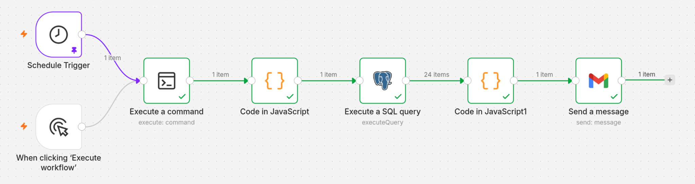
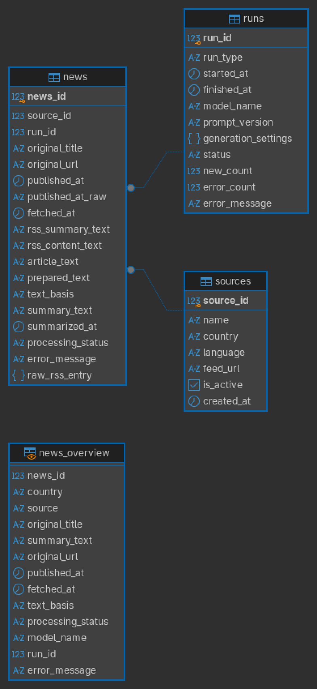

# Stage 6 — PostgreSQL and Daily n8n Automation

[Project overview](../README.md)

## Operational result

The final prototype archives eligible same-day RSS data, selects randomly, summarizes locally, and sends one digest. I confirmed successful **scheduled execution on 8 October 2026**, with the browser page closed. The schedule is **daily at 12:30 Europe/Berlin**.

A preceding full manual run took approximately ten minutes. Other runs may take longer or shorter.

## Files and workflow

- [daily_news.py](daily_news.py): final archival, date filtering, selection, and summarization logic.
- [import_stage4.py](import_stage4.py): one-time import of the frozen Stage 4 evidence. The daily automation does not use it.
- Stage 4 [preparation](../stage4/prepare_news.py) and [summarization](../stage4/summarize_news_test.py) helpers are imported by the daily script.



The screenshot shows both start triggers connected to the command node, with 24 queried records combined into one email item. I also confirmed that the scheduled workflow completed successfully and delivered the email with the browser page closed.

The final n8n workflow uses a Schedule Trigger connected to the SSH command node, followed by run-ID parsing, a PostgreSQL query of the saved selection, HTML formatting, and Gmail delivery. The manual trigger remains available for testing.

## Final source configuration

| Country | Source | Feed |
|---|---|---|
| Germany | DW | https://rss.dw.com/rdf/rss-en-all |
| Iran | IRNA | https://en.irna.ir/rss |
| China | CGTN — World | https://www.cgtn.com/subscribe/rss/section/world.xml |
| Russia | TASS | https://tass.com/rss/v2.xml |
| Ukraine | Ukrinform | https://www.ukrinform.net/rss/block-lastnews |

Active English sources are read from PostgreSQL's `sources` table. CGTN replaced ECNS after the tested ECNS feed lacked eligible same-day entries.

## Database and selection

| Object | Contents |
|---|---|
| `sources` | Publisher identity, country, language, feed URL, active status |
| `runs` | Execution status, model/prompt/settings, source diagnostics, saved selected IDs and timing |
| `news` | Source/run references, title, URL, dates, parsed RSS entry, prepared text, summary and processing status |
| `news_overview` | Readable joined view |

A uniqueness rule on source and URL prevents duplicate insertion. The parsed RSS entry is stored as JSON, not as the raw XML bytes. Eligible records are archived before selection and inference. The full article is fetched only for selected items, with one exception: DW date resolution may need article metadata during archival.

Publication timestamps with an explicit timezone are converted to Europe/Berlin before comparing their calendar date with today's date. Dates without a timezone are compared using the calendar date supplied by the publisher; no timezone is invented. Today's date is computed in Europe/Berlin at runtime. Modification-date fallback is disabled by default. DW uses linked `datePublished` metadata when feed dates are missing.

`random.SystemRandom().sample` selects up to five unique IDs from each source's eligible archived pool. Smaller pools contribute all their candidates. The selection is purely random: it uses no interest profile, topic ranking, or model. Selection IDs are saved before generation. Newly archived records that are not selected get the status `skipped`, which is not a failure.

The summarizer is fixed to `mistral-small3.1:latest`, with thinking disabled. English titles remain unchanged. The text source is chosen in this order: article, RSS content, RSS summary. Previously successful summaries can be reused.

## Manual operation

From the repository root, with Python 3.12+, required dependencies, PostgreSQL schema/sources, and Ollama already available:

```bash
python stage6/daily_news.py --sample-per-source 5
```

For unattended execution, keep authentication outside the project:

```bash
PGPASSFILE=/path/outside/repository/pgpass python -u stage6/daily_news.py --sample-per-source 5 --non-interactive
```

Replace the placeholder with a correctly configured libpq password file. The n8n SSH command must use the intended Python environment and an absolute script path. Python writes to PostgreSQL; n8n performs email delivery.

To retry a saved selection, use `--resume-run RUN_ID`. The retry keeps the saved selection and does not fetch or draw again; it still checks that the prompt and model are unchanged. A new run on the same day can select earlier stories again, and the system does not guarantee that each story is emailed only once.

## Workflow template and database setup

Import [rss_daily_news_workflow.json](rss_daily_news_workflow.json) into n8n to inspect or adapt the workflow. This public copy is inactive and contains no saved credential references or pinned execution data. The email recipient and SSH command paths are placeholders. Configure your own SSH, PostgreSQL, and Gmail credentials, replace the recipient and command paths, test the workflow, then publish it. The template explicitly sets Europe/Berlin and a daily 12:30 schedule; the original export inherited its timezone from the configured instance.

The SQL query reads the run's saved `selected_news_ids`, so a selected story is included even when its database row was created by an earlier run. JavaScript combines all query rows into one escaped HTML digest.

The [database schema](schema.sql) was exported from PostgreSQL 18.6 with no ownership or privilege statements. It defines three tables, their identity sequences, primary/foreign keys, uniqueness and status checks, four news indexes, and the joined view. It contains no news records, passwords, or source rows. Use PostgreSQL 18 and a compatible psql client for this original dump.

For a new, empty database, from the repository root:

```bash
psql -h 127.0.0.1 -U rss_app -d rss_news -W -v ON_ERROR_STOP=1 --single-transaction -f stage6/schema.sql
psql -h 127.0.0.1 -U rss_app -d rss_news -W -v ON_ERROR_STOP=1 --single-transaction -f stage6/sources.sql
```

The database and login role must already exist. Run these two commands once, in this order, and only on a new, empty installation. Do not repeat them against a working database; they are not migrations.

[sources.sql](sources.sql) restores five active English feeds and the inactive historical ECNS source. It preserves source IDs and creation timestamps and restores the source identity sequence. It contains only the publisher configuration; each user supplies their own credentials.



## Operating limits

The host must be powered on, awake, online, and running n8n, SSH, PostgreSQL, and Ollama. The browser can be closed, but the workflow does not run while the host is shut down or suspended. On some days a feed has fewer eligible entries, and the digest contains fewer than 25 items. RSS-summary fallbacks provide limited context. A concurrency lock prevents overlapping Python processes. If a source or model request fails, the email for that run may not be sent.

Gmail was originally authorized in Google OAuth testing mode, so the authorization needs a permanent setup before the system can run unattended for a long time. Do not delete database records while a run is active.
